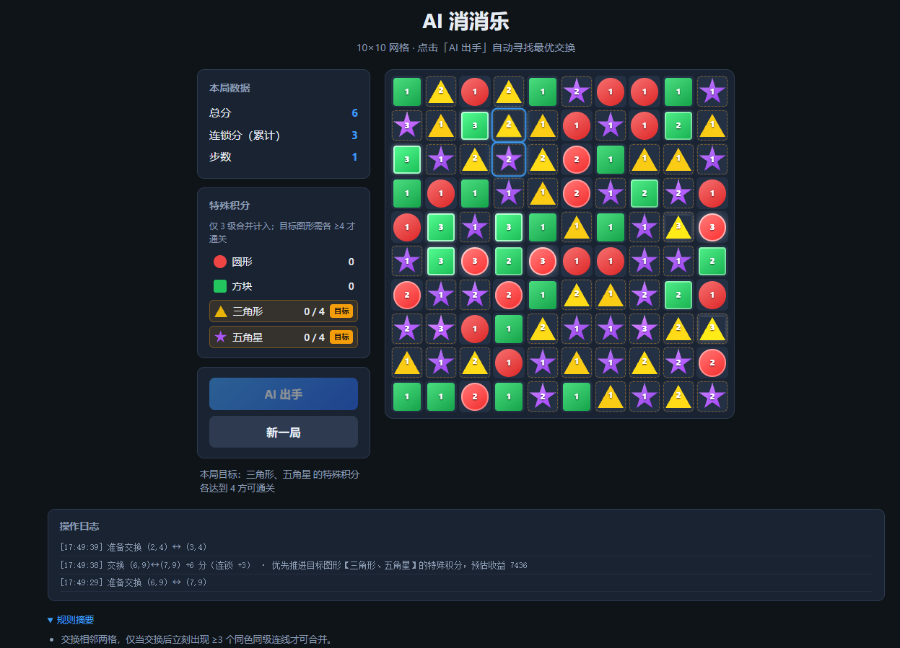

# AI 消消乐（强化学习版）

10×10 网格消消乐。项目包含一套 Python 训练/推理链路和一套浏览器 JS 对局链路，二者通过统一的状态、观测与动作编码对齐。



## 一、核心特性

- **MaskablePPO 强化学习**：动作空间 180 维（90 横向 + 90 纵向相邻交换）
- **多输入观测**：`board` 28 通道 × 10×10 棋盘 + `global` 15 维全局向量
- **本地推理服务**：浏览器每回合请求 Python 服务获取 RL 推荐走法
- **课程学习**：难度 1–3 逐步增加步数限制、任务目标与冻结格
- **训练防抖**：
  - 仅允许「有效交换」（能触发消除或道具）进入动作 mask
  - 空转交换惩罚、每步成本、连续重复同一动作惩罚
  - 观测包含上一动作特征 `last_action`
- **推理防抖**：
  - 若模型重复上一动作，优先切换到其他合法动作
  - 支持 `--stochastic` 非确定性推理模式

## 二、快速开始（训练 → 推理 → 游戏）

### 1) 安装依赖（一次）

```bash
conda activate rlgame
cd rl_python
pip install -r requirements.txt
```

### 2) 训练模型

默认输出到 `rl_python/runs/ppo_match3/`：

```bash
cd rl_python
python train/train_ppo.py --curriculum 3 --timesteps 500000 --n-envs 8
```

指定保存目录（推荐用于多轮实验，如 `ppo_match3_v2`）：

```bash
python train/train_ppo.py --curriculum 3 --timesteps 800000 --n-envs 8 --save-dir runs/ppo_match3_v2
```

常用参数：

| 参数 | 默认值 | 说明 |
|------|--------|------|
| `--curriculum` | `3` | 课程难度 1（简单）/ 2（中等）/ 3（完整） |
| `--timesteps` | `500000` | 总训练步数 |
| `--n-envs` | `8` | 并行环境数 |
| `--save-dir` | `runs/ppo_match3` | 模型、checkpoint、TensorBoard 日志目录 |
| `--seed` | `42` | 随机种子 |

训练产物说明：

```text
runs/<实验名>/
├─ checkpoints/     # 每 1 万步中间模型（gitignored）
├─ best/            # 评估最优模型 best_model.zip（已提交 git）
├─ eval/            # 评估日志 evaluations.npz（gitignored）
├─ tb/              # TensorBoard 事件文件（gitignored）
└─ final_model.zip  # 训练结束最终模型（已提交 git）
```

查看训练曲线：

```bash
tensorboard --logdir runs/ppo_match3_v2/tb
```

### 3) 启动推理服务（必须先启动）

使用最终模型（路径可带或不带 `.zip`）：

```bash
conda activate rlgame
cd rl_python
python serve/predict_server.py --model runs/ppo_match3_v2/final_model
```

使用评估最优模型：

```bash
python serve/predict_server.py --model runs/ppo_match3_v2/best/best_model
```

非确定性模式（更不容易重复动作，推荐对局时使用）：

```bash
python serve/predict_server.py --model runs/ppo_match3_v2/final_model --stochastic
```

自定义端口：

```bash
python serve/predict_server.py --model runs/ppo_match3_v2/final_model --host 127.0.0.1 --port 8765
```

看到 `推理服务: http://127.0.0.1:8765` 表示启动成功。

API：

- `GET  /health` — 健康检查，返回 `{"ok": true, "model_loaded": true}`
- `POST /predict` — 传入前端序列化的局面 JSON，返回 `{action, from, to, reason}`

### 4) 启动前端游戏

```bash
# 从仓库根目录运行
python -m http.server 8080
```

浏览器打开 [http://localhost:8080](http://localhost:8080)，点击「RL 出手」即可调用模型。

> 推理服务默认地址为 `http://127.0.0.1:8765`，定义在 `src/ai/rl-policy.js` 的 `RL_API`。

## 三、强化学习观测向量（obs）

策略网络输入为 Gymnasium `Dict` 观测，Python 与 JS 侧编码逻辑一致。

### 3.1 总体结构

| 字段 | 形状 | 取值范围 | 说明 |
|------|------|----------|------|
| `board` | `(28, 10, 10)` | `[0, 1]` | 棋盘空间特征，每格多通道 one-hot / 标志位 |
| `global` | `(15,)` | `[0, 1]` | 全局标量特征（步数、分数、任务进度等） |

对应代码：`rl_python/env/observation.py`、`src/rl/observation.js`。

### 3.2 `board` 通道（20 通道）

棋盘为 10 行 × 10 列，每格在同一 `(r, c)` 位置可激活多个通道（例如普通格既占图形通道，也可能占冻结通道）。

| 通道索引 | 名称 | 含义 |
|----------|------|------|
| 0–2 | `circle` L1 / L2 / L3 | 圆形普通格，等级 1–3 |
| 3–5 | `square` L1 / L2 / L3 | 方形普通格，等级 1–3 |
| 6–8 | `triangle` L1 / L2 / L3 | 三角形普通格，等级 1–3 |
| 9–11 | `star` L1 / L2 / L3 | 星形普通格，等级 1–3 |
| 12 | `powerup_column` | 列消道具格 |
| 13 | `powerup_bomb` | 九宫格炸弹道具格 |
| 14 | `powerup_color` | 同形全消道具格 |
| 15 | `frozen` | 该格被冻结（不可交换） |
| 16 | `target_circle_L1` | 目标圆形，等级 1 |
| 17 | `target_circle_L2` | 目标圆形，等级 2 |
| 18 | `target_circle_L3` | 目标圆形，等级 3（含道具格） |
| 19 | `target_square_L1` | 目标方形，等级 1 |
| 20 | `target_square_L2` | 目标方形，等级 2 |
| 21 | `target_square_L3` | 目标方形，等级 3（含道具格） |
| 22 | `target_triangle_L1` | 目标三角形，等级 1 |
| 23 | `target_triangle_L2` | 目标三角形，等级 2 |
| 24 | `target_triangle_L3` | 目标三角形，等级 3（含道具格） |
| 25 | `target_star_L1` | 目标星形，等级 1 |
| 26 | `target_star_L2` | 目标星形，等级 2 |
| 27 | `target_star_L3` | 目标星形，等级 3（含道具格） |

空位（`null`）不激活任何通道。

### 3.3 `global` 向量（15 维）

| 索引 | 名称 | 计算公式 | 说明 |
|------|------|----------|------|
| 0 | `steps_used_ratio` | `steps_used / total_steps` | 已用步数占比 |
| 1 | `steps_left_ratio` | `steps_left / total_steps` | 剩余步数占比 |
| 2 | `score_norm` | `min(1, score / 5000)` | 总分归一化 |
| 3 | `chain_score_norm` | `min(1, chain_score_total / 3000)` | 连锁分归一化 |
| 4–7 | `task_score_*` | `task_scores[shape] / 4` | 四种图形各自任务进度（目标为 4） |
| 8–11 | `is_target_*` | `1` 若该图形是本局目标，否则 `0` | 目标图形 one-hot |
| 12 | `min_target_progress` | `min(task_scores[target] / 4)` | 最慢目标图形的完成度 |
| 13 | `won` | `1` 若已通关，否则 `0` | 胜负标志 |
| 14 | `last_action_norm` | `(last_action + 1) / 180` | 上一步动作编号归一化（无历史时为 `-1` → `0`） |

### 3.4 动作空间与 mask

- **动作总数**：180（`MAX_ACTIONS`）
  - `0–89`：水平相邻交换，`action = r * 9 + c`（`(r,c)` 与 `(r,c+1)`）
  - `90–179`：垂直相邻交换，`action = 90 + r * 10 + c`（`(r,c)` 与 `(r+1,c)`）
- **动作 mask**：仅「有效交换」为 `1`（交换后能消除、触发道具或得分）；若无有效交换则退化为全部相邻交换，避免环境卡死。

对应代码：`rl_python/match3_engine/actions.py`、`src/actions/encoding.js`。

### 3.5 课程难度（`--curriculum`）

| 等级 | 步数上限 | 任务目标数 | 目标图形数 | 冻结格 |
|------|----------|------------|------------|--------|
| 1 | 150 | 2 分/图形 | 1 种 | 否 |
| 2 | 120 | 3 分/图形 | 2 种 | 是 |
| 3 | 100 | 4 分/图形 | 2 种 | 是 |

## 四、项目目录与文件职责

```text
match3-ai/
├─ index.html                         # 前端入口：棋盘 UI、侧边栏统计、RL/新局按钮
├─ style.css                          # 页面样式（布局、棋盘格、按钮、日志面板）
├─ README.md                          # 项目说明文档
├─ .gitignore                         # Git 忽略规则（训练产物、__pycache__ 等）
├─ src/
│  ├─ core/
│  │  ├─ index.js                     # core 模块统一导出（供 UI 层引用）
│  │  ├─ constants.js                 # 棋盘尺寸、图形类型、动作空间、步数上限等常量
│  │  ├─ cells.js                     # 普通格/道具格数据结构与类型判定
│  │  ├─ board.js                     # 棋盘创建、克隆、边界判断
│  │  ├─ gravity.js                   # 消除后掉落补充、随机洗牌、冻结格生成
│  │  ├─ match.js                     # 三连匹配检测、合并升级、道具生成
│  │  ├─ powerup.js                   # 三种道具（列消/炸弹/同形）作用范围与解冻
│  │  ├─ resolver.js                  # 交换后整步结算（消除链、道具连锁、得分）
│  │  └─ game-state.js                # 对局状态创建、提交移动、记录 lastAction
│  ├─ actions/
│  │  └─ encoding.js                  # 动作编解码（180 维）、相邻交换枚举
│  ├─ rl/
│  │  ├─ observation.js               # JS 侧观测编码（20 通道 + 15 维 global）
│  │  └─ reward.js                    # JS 侧奖励定义（与 Python 训练奖励对齐参考）
│  ├─ ai/
│  │  ├─ rl-policy.js                 # 调用推理服务 /health、/predict；序列化局面 JSON
│  │  └─ heuristic.js                 # 启发式策略（无模型时的备用走棋逻辑）
│  └─ ui/
│     └─ render.js                    # DOM 渲染、交换动画、RL 按钮、操作日志
└─ rl_python/
   ├─ requirements.txt                # Python 依赖（gymnasium、sb3、torch 等）
   ├─ match3_engine/                  # 游戏引擎（与 JS core 规则对齐）
   │  ├─ __init__.py                  # 包导出
   │  ├─ constants.py                 # ROWS/COLS/SHAPES/MAX_ACTIONS 等常量
   │  ├─ cells.py                     # NormalCell、PowerCell 数据结构
   │  ├─ board.py                     # 棋盘克隆、边界、空格判定
   │  ├─ gravity.py                   # 掉落、补充、洗牌、冻结
   │  ├─ match.py                     # 匹配检测与合并升级
   │  ├─ powerup.py                   # 道具效果与范围计算
   │  ├─ resolver.py                  # try_swap / 整步结算主逻辑
   │  ├─ actions.py                   # 动作编解码、有效交换 mask 构造
   │  └─ game.py                      # GameState、create_game_state、execute_move
   ├─ env/
   │  ├─ __init__.py                  # 包导出
   │  ├─ match3_env.py                # Gymnasium 环境（reset/step/action_masks/课程学习）
   │  ├─ observation.py               # 训练观测编码（board 20ch + global 15d）
   │  └─ reward.py                    # 训练奖励（消除分、任务分、空转/重复动作惩罚）
   ├─ train/
   │  ├─ train_ppo.py                 # MaskablePPO 训练入口（checkpoint + eval 回调）
   │  └─ eval.py                      # 模型评估（胜率 / 平均分 / 平均回报）
   ├─ serve/
   │  ├─ state_codec.py               # 前端 JSON ↔ Python GameState 转换
   │  └─ predict_server.py            # HTTP 推理 API（含动作去抖、CORS）
   ├─ tests/
   │  ├─ test_engine.py               # 引擎与环境冒烟测试（步进、观测形状）
   │  └─ test_predict_load.py         # 加载模型并执行一次 predict 的脚本
   └─ runs/                           # 训练产物（部分已提交 git，见下方说明）
       └─ ppo_match3_v2/               # 示例实验目录（final_model.zip 和 best/ 已提交）
```

## 五、训练与推理链路

**训练阶段（Python 内闭环）：**

1. `Match3Env.reset()` 按课程难度创建新局
2. `build_observation()` 生成 `{"board", "global"}`
3. 模型根据 `obs + action_mask` 选择动作
4. `step(action)` 调用引擎执行交换与结算
5. `compute_reward()` 计算奖励并进入下一步

**推理阶段（浏览器 + Python 服务）：**

1. 前端 `serializeState(state)` 上送当前局面 JSON
2. 服务端 `json_to_game_state()` 还原 `GameState`
3. 生成 `obs + mask`，模型 `predict()`
4. 若动作重复上一手，尝试切换备选合法动作
5. 返回 `from/to` 坐标给前端执行并播放动画

## 六、评估模型

```bash
# 在 rl_python/ 目录下运行
python train/eval.py --model runs/ppo_match3_v2/final_model --curriculum 3 --episodes 100

# 随机策略基线（不传 --model）
python train/eval.py --curriculum 3 --episodes 100
```

输出指标：

| 指标 | 含义 |
|------|------|
| `win_rate` | 通关率 |
| `avg_score` | 平均游戏分 |
| `avg_return` | 平均 RL 累积回报 |

## 七、运行测试

```bash
# 在 rl_python/ 目录下运行
python -m pytest tests/test_engine.py -v
```

手动验证模型可加载（需本地已有对应模型文件）：

```bash
python tests/test_predict_load.py
```
